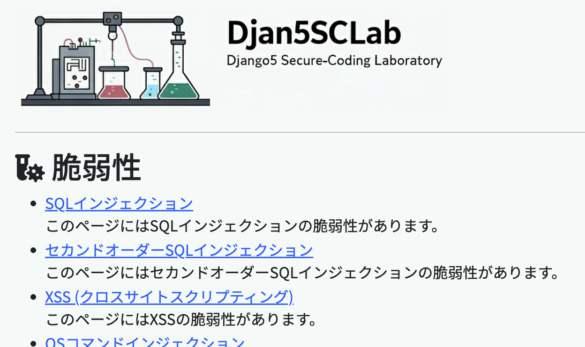

# Pythonで学ぶ安全・安心なアプリの作り方[](https://github.com/anoyoroshi/dsclab/blob/main/LICENSE) [](https://github.com/anoyoroshi/dsclab/releases/latest)
# DSCLab（Django5 Secure-Coding Laboratory）



**Django5フレームワークを用いたWebアプリケーションのセキュアコーディングを実践的に学ぶための演習環境です。**

本書をご購入いただき誠にありがとうございます。このリポジトリには、以下のものが含まれています。

* **ダウンロード可能なやられアプリのコード:** 脆弱性のあるWebアプリケーションを通じて、セキュリティの脅威と対策を体験的に学習できます。

### セットアップ手順

本書のセクション2-4「やられアプリ（DSCLab）のセットアップ」をご参照ください。

### やられアプリのライセンス

本書の2-1-4「本書のサンプルアプリのライセンス」をご参照ください。

### 目次

* Chapter 1　Webアプリケーションの脆弱性の基礎
* Chapter 2　Pythonサンプル(やられ)アプリのセットアップ
* Chapter 3　Webアプリケーションの基礎
* Chapter 4　SQLインジェクション
* Chapter 5　クロスサイトスクリプティング（XSS）
* Chapter 6　その他のインジェクション
* Chapter 7　クロスサイトリクエストフォージェリ（CSRF）
* Chapter 8　パストラバーサルとXXE、認証・認可
* Chapter 9　ライブラリの脆弱性管理
* Chapter 10　代表的なセキュリティテストツール

### 対象読者

* Pythonのスキルレベルを問わず、Webアプリケーション開発に携わる全ての方
* Webアプリケーションを開発経験はあるものの、セキュリティ対策に不安を感じている方
* セキュリティ用語はある程度理解しているが、具体的な対策方法や最新トレンドを知りたい方
* Pythonサンプルアプリへの攻撃を通して、脆弱性(SQLインジェクション、クロスサイトスクリプティングなど)が生まれる原因とその解説、具体的な対処方法を学びたい方
* 企業のセキュリティ担当者、ペネトレーションテスト担当者、セキュリティエンジニア、またはセキュリティに興味のある学生

ぜひ、本書と合わせてこのDSCLabを活用し、安全なWebアプリケーション開発のスキルを向上させてください。

## 書籍で解説するセキュアコード対策例（コピー＆ペースト用）

本書では、DSCLabを用いた演習を通して、様々な脆弱性の原因と対策について詳しく解説しています。ここでは、各脆弱性に対するセキュアコード例を、コピー＆ペーストしやすい形式でご紹介します。詳細な解説は、本書の該当ページおよび該当ファイルをご参照ください。

> 2-2-3「ワンポイント DSCLabサンプルアプリをより深く理解するために - DjangoのMTVモデル」で述べておりますが、
> 各脆弱性の紹介では関連するソースコードがまとまって登場します。
> コード量が多かったり見慣れない構文が出てきたりして戸惑うこともあるかもしれませんが、全てのコードの仕組みをすぐに理解する必要はありません。
> コードが登場した後では脆弱性が入っている重要な部分に焦点を当てて解説していきますので、まずは脆弱性の解説に集中して読み進めていきましょう。

<details><summary>4-2 SQLインジェクション</summary>

**対策例1（p.158）:**
```python
        data['users'] = User.objects.filter(name=name, password=password).order_by('id')
```
**対策例2（p.160）:**
```python
        data['users'] = User.objects.filter(name=name).filter(password=password).order_by('id')
```
**対策例3（p.161）:**
```python
        conditions = {
            'name': name, 'password': password
        }
        data['users'] = User.objects.filter(**conditions).order_by('id')
```
**対策例4（p.162）:**
```python
from django.db.models import Q #Qオブジェクトを使うためにインポート
        data['users'] = User.objects.filter( Q(name=name) & Q(password=password) ).order_by('id')
```
</details>

<details><summary>4-4 セカンドオーダーSQLインジェクション</summary>

**対策例（p.189）:**
```python
        user = User.objects.filter(name=name).first()

        if user:
           data['message'] = '%s さんのパスワードは %s 暗証番号は %s です。' % (user.name, user.password, user.secret)
```
</details>

<details><summary>5-3 XSS</summary>

**対策例1（p.228）:**
```python
from django.utils.html import escape #escape()関数を使うためにインポート
            data['msg'] = escape(input_str)
```
**対策例2（p.229）:**
```html
      
    <p>{{ msg }}</p><br/>
      
```
**対策例3（p.229）:**
```html
    
    <p>{{ msg }}</p><br/>
    
```
**対策例4（p.230-231）:**
```bash
pip install bleach
```

```python
import bleach #bleach()関数を使うためにインポート

def sanitize_html(input_string):
  """
  入力文字列をサニタイジングする関数
  Args:
    input_string: サニタイジングする文字列
  Returns:
    サニタイジングされた文字列
  """
  # 許可するタグ
  allowed_tags = ['a', 'b', 'i', 'p']
  # 許可する属性
  allowed_attributes = {'a': ['href', 'title']}

  # サニタイジング処理
  sanitized_string = bleach.clean(input_string, tags=allowed_tags, attributes=allowed_attributes, strip=True)
  return sanitized_string

            data['msg'] = sanitize_html(input_str) # _532_xss関数
```

**対策例4 【Docker環境を使用している場合のみ必要な対応】**
```requirements.txt
# Docker環境を使用している場合は、requirements.txtに以下の行を追加し、
# その後Dockerイメージを再ビルドしてください。
#
# validate_email==1.3
bleach # 追加
```

</details>

<details><summary>6-1 OSコマンドインジェクション</summary>

**対策例1（p.262）:**
```python
        cmd = ['echo', f'Hello, {command}']
        result = subprocess.run(cmd, shell=False, capture_output=True, text=True)
        if result.returncode == 0:
            data['result'] = _('msg.echo.command.success') # result.stdoutは残す
            data['result'] += "\n\n" + result.stdout
        else:
            data['errmsg'] = _('msg.echo.command.failure') # result.stderrは削除
```
**対策例2（p.263）:**
```python
        command = shlex.quote(command) # shlex.quote()を使用したサニタイズを追加
```
</details>

<details><summary>6-4 コードインジェクション</summary>

**対策例（p.291）:**
```python
import ast #追加
                data['value'] = str(ast.literal_eval(expression)) #変更
```
**対策例(四則演算実装付き):**
```python
import ast
import operator
import traceback
from django.shortcuts import render
from django.utils.translation import gettext as _

SAFE_OPERATIONS = {
    '+': operator.add,
    '-': operator.sub,
    '*': operator.mul,
    '/': operator.truediv,
}

def safe_arithmetic_eval(expression):
    try:
        node = ast.parse(expression, mode='eval').body
        return _evaluate_arithmetic_node(node)
    except (SyntaxError, TypeError, ValueError):
        return "不正な数式です"
    except Exception:
        return "エラーが発生しました"

def _evaluate_arithmetic_node(node):
    if isinstance(node, ast.Num):
        return node.n
    elif isinstance(node, ast.BinOp):
        left = _evaluate_arithmetic_node(node.left)
        right = _evaluate_arithmetic_node(node.right)
        op_type = type(node.op)
        if op_type == ast.Add:
            op = SAFE_OPERATIONS.get('+')
        elif op_type == ast.Sub:
            op = SAFE_OPERATIONS.get('-')
        elif op_type == ast.Mult:
            op = SAFE_OPERATIONS.get('*')
        elif op_type == ast.Div:
            op = SAFE_OPERATIONS.get('/')
        else:
            raise TypeError(f"許可されていない演算子: {ast.unparse(node.op)}")

        if op:
            return op(left, right)
        else:
            raise TypeError(f"許可されていない演算子: {ast.unparse(node.op)}")
    else:
        raise TypeError("許可されていない要素が含まれています")


def _642_code_injection(request):
    data = {
        'breadcrumbs_title': _('function.name.code.injection'),
        'title': _('title.codeinjection.page'),
        'note': _('msg.note.codeinjection'),
    }
    if request.method == 'POST':
        expression = request.POST.get('expression', '')
        if expression and len(expression) > 0:
            data['expression'] = expression
            try:
                data['value'] = str(safe_arithmetic_eval(expression)) # 置き換え
            except TypeError as e:
                data['errmsg'] = str(e)
            except Exception as e:
                print(traceback.format_exc())
                data['errmsg'] = _("msg.invalid.expression") % {"exception": e}
            finally:
                pass
    return render(request, '642_code_injection.html', data)

```
</details>

<details><summary>7-1 CSRF</summary>

**対策例（p.323）:**
```python
# @csrf_exempt を削除 (同ドメインのため、CSRFトークンは使用しない)
def _712_csrf(request):
```
</details>

<details><summary>8-1 パストラバーサル</summary>

**対策例（p.374）:**
```python
    if filename:
        # 許可されたファイル名のみを許可
        allowed_filenames = ['812_path_traversal.html', 'base.html']
        if filename in allowed_filenames:
            # 脆弱性のあるコード: ユーザ入力を直接パスに利用
            base_dir = os.path.join(settings.BASE_DIR, 'templates')
            filepath = os.path.join(base_dir, filename)
            # パスの正規化
            filepath = os.path.normpath(filepath)
            # ベースパス以外へのアクセスを防ぐ
            if not filepath.startswith(base_dir):
                data['message'] = 'アクセスできません'
                return render(request, '812_path_traversal.html', data)
            try:
                with open(filepath, 'r') as f:
                    content = f.read()  
                    data['content'] = content  
                    data['filepath'] = filepath  
            except FileNotFoundError:
                data['message'] = 'ファイルが見つかりません'
        else:
           data['message'] = '利用不能な入力です' # エラーメッセージを追加
```
</details>

---

Copyright © 2025 MoriShohei

このリポジトリのコードは、MITライセンスの下で公開されています。
